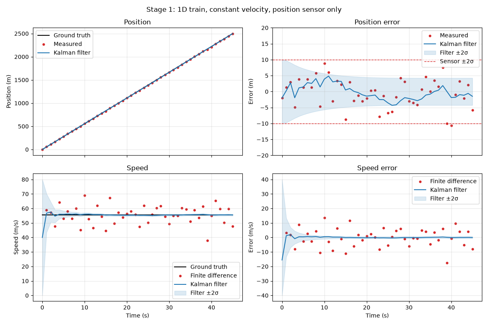

# kalman-tracking
A learning project on state estimation and target tracking. It starts with a 1D Kalman filter for a train on a straight track and builds step by step towards a 2D/3D multi-target radar tracker with systematic performance evaluation.

The filters are developed in Python first and then ported to C++. Python remains the layer for simulation, evaluation and plotting.

## Setup (Python)

Requires Python 3.13 or newer.

Clone the repository then navigate to the project directory, create a virtual environment and install the dependencies:

```sh
python -m venv .venv
source .venv/bin/activate      # Windows: .venv\Scripts\activate
pip install -e .
```

`pip install -e .` installs the dependencies and makes the shared modules in `python/` (e.g. `helpers`) importable from every stage. Then run a stage, e.g.:

```sh
python python/01_1D_Train/Train_1D.py
```

If you get `ModuleNotFoundError: No module named 'helpers'`, the virtual environment is not active or `pip install -e .` has not been run.

## Stage 1: 1D Kalman filter for a train on a straight track

A train moves along a straight track of length $\ell$ at a constant speed $v_0$. A position sensor measures the train's position every $T_s$ seconds with Gaussian noise. A Kalman filter with a 2nd-order kinematic model (constant-velocity model, [1], Sec. 12.2) estimates position **and** speed, although the speed is never measured.
 
### Model
 
$$
\mathbf{x}(k) = \begin{bmatrix} s(k) \\ v(k) \end{bmatrix}, \qquad
\mathbf{A}_d = \begin{bmatrix} 1 & T_s \\ 0 & 1 \end{bmatrix}, \qquad
\mathbf{C} = \begin{bmatrix} 1 & 0 \end{bmatrix}, \qquad
R = \sigma^2
$$
 
([1], Eq. 12.3, 12.4 and 1.18). Filter equations: [1], Eq. 12.24–12.28, in the order *correct with measurement k, then predict to k+1*.
 
**Process noise.** [1], Sec. 12.2 gives three ways to discretize it. All three are implemented, written with $\text{Var}(z_v)$, the velocity change per step:
 
| Method | $\mathbf{G}_d \mathbf{Q} \mathbf{G}_d^T$ | Reference |
|---|---|---|
| Direct discretization | $\begin{bmatrix} T_s^2 & T_s \\ T_s & 1 \end{bmatrix} \text{Var}(z_v)$ | [1], Eq. 12.11 |
| Piecewise constant noise (used below) | $\begin{bmatrix} T_s^2/4 & T_s/2 \\ T_s/2 & 1 \end{bmatrix} \text{Var}(z_v)$ | [1], Eq. 12.17 |
| Discretized continuous model | $\begin{bmatrix} T_s^2/3 & T_s/2 \\ T_s/2 & 1 \end{bmatrix} \text{Var}(z_v)$ | [1], Eq. 12.19 |
 
### Parameters
 
| Scenario | Value |
|---|---|
| Track length $\ell$ | 2,500 m |
| Initial position $s_0$ | 0 m |
| Speed $v_0$ | 55.55 m/s (200 km/h) |
| Sampling time $T_s$ | 1.0 s |
| Measurement noise $\sigma$ | 5.0 m |
| Random seed | 31 |
 
| Filter | Value |
|---|---|
| Measurement noise $R$ | $\sigma^2$ = 25 m² (matches the simulation) |
| Process noise $\text{Var}(z_v)$ | 0.01 (m/s)², method 2 (Eq. 12.17) |
| Initial state $\hat{\mathbf{x}}_0$ | $[s_{\text{meas}}(0),\ 40\ \text{m/s}]^T$ (speed deliberately wrong) |
| Initial covariance $\hat{\mathbf{P}}_0$ | $\text{diag}(100^2\ \text{m}^2,\ 20^2\ (\text{m/s})^2)$ |

### Results



The speed baseline is the finite difference of consecutive position measurements, $(y(k) - y(k-1))/T_s$. RMSE over a single run (seed 31):
 
| RMSE | Raw sensor / finite difference | Kalman filter |
|---|---|---|
| Position, all steps | 4.56 m | 2.29 m |
| Position, after convergence ($k \geq 5$) | 4.70 m | 2.34 m |
| Speed, all steps | 6.32 m/s | 2.34 m/s |
| Speed, after convergence ($k \geq 5$) | 6.33 m/s | 0.26 m/s |

**Observations**
 
- **Speed without a speed sensor.** Starting from 40 m/s (true: 55.55 m/s), the estimate converges within about 3 s. The overall speed RMSE is dominated by this start-up; after convergence the filter is about 25× more accurate than the finite difference.
- **Position.** The filter roughly halves the position error. Its ±2σ band shrinks from the sensor's ±10 m to about ±4.3 m.

These numbers come from one noise realization only. Whether the ±2σ bands are actually right (filter consistency) needs many runs; see next steps.
 
### Next steps
 
- Monte Carlo runs over many seeds with RMSE and NEES/ANEES ([1], Ch. 9)
- Compare the three process noise methods and different values of $\text{Var}(z_v)$, including 0
- Effect of a too small $\hat{\mathbf{P}}_0$ on convergence

## Notation
 
This project follows the notation of [1]:
 
| Symbol | Meaning |
|---|---|
| $s$, $v$ | position, velocity |
| $\mathbf{A}_d$, $\mathbf{B}_d$ | discrete system and input matrix |
| $\mathbf{C}$ | measurement matrix (often $\mathbf{H}$ in English literature) |
| $y$ | measurement |
| $\hat{\mathbf{x}}$, $\hat{\mathbf{P}}$ | **predicted** state and covariance |
| $\tilde{\mathbf{x}}$, $\tilde{\mathbf{P}}$ | **corrected** state and covariance |
| $\mathbf{Q}$, $\mathbf{R}$ | process and measurement noise covariance |
 
> [!NOTE]
> Many English sources use $\hat{\mathbf{x}}$ for the *corrected* estimate.
 
## References
 
[1] R. Marchthaler, S. Dingler: *Kalman-Filter. Einführung in die Zustandsschätzung und ihre Anwendung für eingebettete Systeme*, 2nd ed., Springer Vieweg, 2024. https://doi.org/10.1007/978-3-658-43216-4